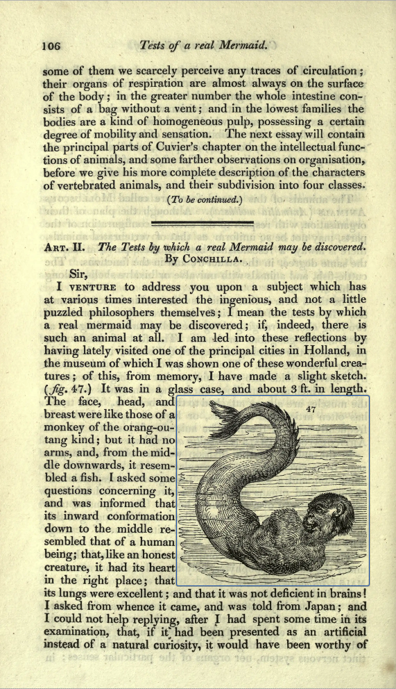

# BHL as linked data

Experiments to render BHL as linked data. 

Note that the goal is not to simply map BHL data dump tables onto arbitrary RDF, but model BHL data such that we could, in principle, build a BHL web interface using SPARQL queries. Leaving aside the wisdom of trying to run BHL on a triple store, setting that as a goal helps clarify the modelling. 

One goal, for example, is to be be able to generate a IIIF manifest for a BHL item from the RDF. This enables us to visually test whether our model works (e.g., can we support page order, the relationship between parts and items). And because a IIIF viewer natuively speaks RDF (the manifest file a viewer needs is JSON-LD), it also means that we think about images and text as annotations, along with more obvious annotations such as taxonomic names, etc.


## Vocabulary

Wherever possible we use [schema.org](https://schema.org) with the **https** protocol (see [Is it http://schema.org or https://schema.org?](https://docs.nde.nl/blog/2026/03/09/schema.org/)).


## Creators

BHL has no master creator table. Credits live in two places: `creator` holds title-level
credits and `partcreator` holds article-level ones, and they overlap by only 10,149 of the
241,475 people and organisations involved. Either table on its own misses most of them —
`creator` knows 79,892, `partcreator` 171,732 — so anything creator-shaped has to read both.
No CreatorID carries more than one spelling of its name, so the name is a clean function of
the id and the two tables cannot disagree about it.

`sql/creator_names.php` parses a BHL creator heading; `sql/export_creators.php` reads the
database configured in `sql/sqlite.php` and writes one record per CreatorID:

```sh
php sql/export_creators.php > creators.json          # a JSON object keyed by CreatorID
php sql/export_creators.php --ndjson > creators.ndjson   # one record per line
```

The export is written as a stream rather than assembled in memory, because the full run is
~241k records.

A heading is not just a name. It arrives with life dates, a qualifier on those dates, an
expansion of the initials and an honorific, all run together — `Flannery, Tim F. (Tim
Fridtjof), 1956-` — and the parser pulls those apart into components named for the
schema.org properties they map onto, so the RDF needs no translation layer. `familyName`,
`givenName`, `additionalName`, `honorificPrefix`, `honorificSuffix`, `birthDate` and
`deathDate` all carry straight through to `schema:`. `initials`, `alternatives` and the
floruit dates have no schema.org equivalent and keep descriptive names.

`name` is the display form and `disambiguatingDescription` keeps the heading exactly as BHL
holds it, cleaned only of invisible characters and normalised to NFC. That is deliberate:
the dates and honorifics that tell two people of the same name apart survive there, so
nothing the catalogue recorded is lost by preferring a tidy display name.

`additionalName` is split off the given name last of all. The display name, the initials and
every alternative spelling are built from the whole given name, so splitting earlier would
drop the middle name out of all of them — `initials` for "Lawrence Morris" is still `L. M.`,
not `L.`, and `givenName` + `additionalName` round-trips to the original. 47% of creators
have one.

### How far to trust the catalogue

`CreatorType` is two MARC facets welded together with `" - "`: an entry type (`Main`, MARC
1XX, or `Added`, 7XX) and a name type (personal, corporate, meeting). It is worth knowing
how reliable that is before building on it.

Mostly it holds up. `creator_infer_kind()` guesses the kind from the shape of the name alone,
entirely independently of the catalogue, and agrees with the stated type on 95.47% of the
380,555 typed rows. Sampling the 4.53% that disagree shows it cuts both ways rather than
indicting MARC: the largest bucket is corporate headings the heuristic misreads as people
("Cadell & Davies"), and the next is mononyms it cannot place ("Gorachaud."). Disagreement is
a flag, not a verdict.

There are outright errors, but few: 43 creators typed `Personal` whose names are plainly
organisations ("British Museum (Natural History)", "Zoological Society of London.") and 10
that are plainly events ("United States Exploring Expedition 1838-1842"). That is 0.07% of
79,892, and cheap to fix by hand.

The problems that actually matter are structural. 223 creators are typed inconsistently
across their own rows, with no row marked authoritative — `creator_kind_from_types()` takes
the majority and, on a tie, the first kind seen. 10,007 are a main entry on one title and an
added entry on another, so "is this person an author or a contributor" has no answer until
you say *on which title*; entry is a property of the credit, not of the creator, and the
export reports it per CreatorType with counts rather than flattening it. And 554,656 credits
— 59% of the total — come from `partcreator`, which has no `CreatorType` column at all, so
for most credits MARC contributes nothing. Where BHL said nothing the name shape decides the
kind, and `entry`, `role` and `rdf_property` are left `null` rather than defaulted, so an
untyped credit never silently becomes a `creator`.

### Example

`https://www.biodiversitylibrary.org/creator/3044`, trimmed of the null fields:

```json
{
  "id": 3044,
  "name": "Tim Fridtjof Flannery",
  "disambiguatingDescription": "Flannery, Tim F. (Tim Fridtjof), 1956-",
  "kind": "personal",
  "kind_stated": true,
  "label": "person",
  "rdf_class": "schema:Person",
  "parsed": {
    "familyName": "Flannery",
    "givenName": "Tim",
    "additionalName": "Fridtjof",
    "initials": "T. F."
  },
  "alternatives": [
    "Flannery, Tim Fridtjof",
    "Tim F. Flannery",
    "Flannery, Tim F.",
    "T. F. Flannery",
    "Flannery, T. F."
  ],
  "dates": { "birthDate": 1956, "deathDate": null, "uncertain": false, "text": "1956" },
  "types": [
    { "type": "Main - Personal Name", "entry": "main", "role": "author", "count": 1 }
  ],
  "credits": { "titles": 1, "parts": 10, "main": 1, "added": 0 },
  "identifiers": {
    "DLC": ["n85147539"],
    "ORCID": ["https://orcid.org/0000-0002-3005-8305"],
    "ResearchGate Profile": ["Timothy_Flannery2"],
    "SNAC ARK": ["w63f5xdp"],
    "VIAF": ["69097200"],
    "Wikidata": ["Q728660"]
  }
}
```

`identifiers` is grouped by scheme because a creator can carry more than one value for the
same one, and it is the obvious starting point for `owl:sameAs`. `alternatives` are for
matching and for `skos:altLabel` — both orderings and both levels of abbreviation, since
"N. C. Kindberg" and "Nils Conrad Kindberg" are the same person written two ways and both
need to be findable.

### Linking works to creators

The work links are deliberately *not* in the JSON. They are edges rather than properties of
the creator, there are 933,515 of them against 241,475 creators, and they fall out of two
queries:

```sql
-- title links. Main wins where BHL records a pair as both
SELECT CreatorID,
       CASE WHEN SUM(CreatorType LIKE 'Main%') > 0 THEN 'creator'
            ELSE 'contributor' END AS role,
       TitleID
FROM creator
GROUP BY CreatorID, TitleID;

-- part links; partcreator has no CreatorType, so these are creator by fiat
SELECT DISTINCT CreatorID, PartID FROM partcreator;
```

giving

```
<.../bibliography/43>   schema:creator     <.../creator/1> .
<.../bibliography/2760> schema:contributor <.../creator/1> .
<.../part/182775>       schema:creator     <.../creator/5597> .
```

Note `/bibliography/{TitleID}`, not `/title/` — that is the URI `sql/sql2rdf.php` builds for
a title, and the links have to agree with it to join up.

The `GROUP BY` in the first query is doing real work. 1,682 creator+title pairs — 0.444% of
the 378,859 distinct pairs — are recorded by BHL as both `Main` and `Added`, and without it
each would emit `schema:creator` and `schema:contributor` for the same pair, claiming and
disclaiming the work at once. 380,541 triples become 378,859. Nothing is formally violated by
leaving them in, since the two predicates are not disjoint, but a query for "who created
this" would also find them listed as a contributor.

The seven `Not Specified` pairs fall to `contributor` under that `CASE`; flip the `ELSE` if
they should go the other way, as they are genuinely untyped rather than added entries. And
the part links are the honest weak point: `creator` there is an assumption, not something BHL
recorded, and it covers 59% of all credits.

## IIIF

Use IIIF Presentation API version 3 to model a BHL item. The key idea behind the IIIF model is that there is a virtual page (the “canvas”) which we annotate. **Everything is an annotation**, the page image, the OCR text, etc. This enables us to think about having multiple page images for the same page (e.g, an original scan image, a highly compressed black and white image, etc.), as well as having multiple text annotations (for example, OCR output provided by Internet Archive, as well as more powerful LLM-based tools). We can also have annotations for blocks of text or words, such as taxonomic names. The model allows for different versions of the data.

To explore this idea, we take an Internet Archive scandata.xml file and convert it to a IIIF `manifest.json` file. The canvas (virtual page) dimensions are the cropbox width and height in the scandata file, and we can compute the approximate image sizes for the _thumbnail and _large WEBP images stored on [AWS](https://registry.opendata.aws/bhl-open-data/) based on standard widths of 150 and 930 pixels, respectively. Alternatively we can use the _full image which has the same dimensions as the scan.

We can treat OCR text as a canvas-level annotation, and also add smaller annotations (such as location of taxonomic names on a page). The canvas dimensions are the same as page dimensions in the Internet Archive OCR outputs, so we can use those coordinates directly. Note that for LLM-based OCR tools we will may have text-based rather than coordinate-based annotations, as the output from those tools often do not include word-level coordinates.

### Canvas dimensions

Parsing a `scandata.xml` file per item works, but it means fetching one file at a
time and re-deriving the same facts on every run. The [bhl-scandata](https://github.com/rdmpage/bhl-scandata)
repo has already done that pass over all 347,130 scandata files in the bucket, so
`iiif/canvas2rdf.php` reads the answer out of a database instead. It emits exactly
the triples `iiif/scan2rdf.php` does — the two were run against every scandata
file in `iiif/scandata/` and agree triple for triple on all eight — but it answers
in 0.07s for any of the 346,858 items in the database, rather than only for the
ones whose XML has been downloaded.

```sh
php iiif/canvas2rdf.php journalofarach3832010amer > item.nt
```

The database is `canvas.sqlite` in the root of this repo, one row per canvas:

```sql
CREATE TABLE canvas
(
    barcode TEXT NOT NULL,
    seq     INTEGER NOT NULL,
    leaf    INTEGER NOT NULL,
    width   INTEGER,
    height  INTEGER,
    PRIMARY KEY (barcode, seq)
) WITHOUT ROWID;
```

66,052,352 rows, 2.7 GB, and not in git. Rebuild it with `php
04-export-canvas.php --out=/path/to/bhl-as-linked-data/canvas.sqlite` in the
bhl-scandata repo, which takes about six minutes and needs that repo's
`pages.sqlite` (13 GB, on the external volume).

Three things are already applied, so nothing downstream has to remember them:

- Leaves excluded from the access formats are **not in the table**. Colour cards,
  targets and leaves marked `Delete` are photographed but never shown, and a
  manifest built without consulting `addToAccessFormats` shows them anyway.
- `seq` is a 1-based counter over the leaves that remain, and it is what appears
  in the `_thumb`/`_large`/`_full` derivative filenames. It is **not** `leafNum`.
  The two diverge from the first excluded leaf onwards, and because both numbers
  usually resolve, the wrong one returns a different page's image with HTTP 200
  rather than a 404. `leaf` is kept alongside as the link back to the scan data
  and to the OCR.
- `width` and `height` are the `cropBox`, which is the size of the image actually
  served and the coordinate space IA's OCR uses, falling back to
  `origWidth`/`origHeight` for the older scribe-format items that have no cropBox.

A dimension the scan data does not give is `NULL`, never `0` — 5,662 leaves carry
zeroes in the source, and a zero would assert a canvas size that is wrong rather
than one that is missing. `canvas2rdf.php` skips those canvases and says so on
stderr.

Keying on barcode rather than on the `<bookId>` element the scan data carries is
safe for BHL: the two are identical for every BHL item, and also identical to the
Internet Archive identifier the canvas URIs are built from. They do diverge for
the ~34,000 items in the bucket that BHL does not hold — `121030` is
`McGillLibrary-121030-1534`, the Springer items are prefixed `springer_` — and for
those the derivatives live under the bookId, not the barcode.

Comparing the two generators turned up a bug in `scan2rdf.php`, now fixed: its
`addToAccessFormats` test had no namespace-qualified alternative, so in the older
scribe format — which declares `xmlns="http://archive.org/scribe/xml"` — the test
matched nothing and every excluded leaf became a canvas anyway. It affected
`magazineofnatura01loud`, whose last four leaves are colour and white cards, and
the manifest and `.nt` in this repo still carry them. The failure is worse than
four spurious canvases at the end: an excluded leaf in the *middle* of an item
shifts every canvas after it against its image, and both numbers resolve, so the
manifest looks right and shows the wrong page. `scan.php` has the same blind spot
in a louder form — it does not register the namespace at all, so a scribe-format
item yields no canvases rather than wrong ones.

Coverage is 312,575 of the 315,211 barcodes in BHL's item table. The 2,636 without
scandata have no dimensions here at all; `iiif.archive.org` serves manifests with
dimensions already filled in and is the obvious fallback.

### IIIF viewers

In exploring the generated IIIF manifests I used the [Tify](https://tify.rocks) and [Mirador](https://projectmirador.org) viewers, and uncovered a number of limitations and "gotchas”. The dicovery and decsription of the issues below was prepared with the help of Claude Code.

Annotations can refer to the whole canvas, or to a specific region of it. It seems logical for a page-level annotation to target the bare canvas URI, but both viewers mishandle this: if any annotation on a canvas lacks an #xywh fragment, no region overlays are drawn for that canvas at all, including for annotations that do have one (Tify #347 (https://github.com/tify-iiif-viewer/tify/issues/347), Mirador #4532 (https://github.com/ProjectMirador/mirador/issues/4532)). The annotations still appear in the text panel — only the boxes go missing.

There is also an issue with multiple AnnotationPages on the same canvas. Tify reads only the first one and silently ignores the rest (Tify #346 (https://github.com/tify-iiif-viewer/tify/issues/346)), so a canvas that separates, say, comments from OCR text will only ever show one of them. Multiple annotations within a single AnnotationPage work fine.

Most significantly, the notional canvas and the image drawn onto it are separate coordinate spaces. An Internet Archive canvas might be 3600 pixels wide while the large derivative we actually draw from AWS is 930 pixels wide. Both viewers assume the two are the same, so annotation coordinates expressed in canvas units — as the spec requires — are drawn at the wrong scale, in this case 3600/930 ≈ 3.87× too large. The two get it wrong differently: Tify divides by the declared body.width (Tify #348 (https://github.com/tify-iiif-viewer/tify/issues/348)), so declaring the image at canvas dimensions accidentally makes it work, whereas Mirador ignores the declaration entirely and uses the decoded image's true pixel size (Mirador #4533 (https://github.com/ProjectMirador/mirador/issues/4533)), so no manifest-level change helps.

Canvas coordinates are worth persevering with for Internet Archive content, because they match the coordinates in IA's OCR files. The <OBJECT> dimensions in _djvu.xml correspond to the <cropBox> dimensions in _scandata.xml — 3600 × 4831 for the pages above — so annotation coordinates taken straight from the OCR need no transformation to align with the canvas. Scaling them into the derivative's coordinate space would make Mirador render correctly today, but would tie every coordinate to whatever size the derivative happens to be.

### Ranges (tables of contents)

BHL parts — the articles within an item — become IIIF `Range`s, listed in the manifest's `structures`. A viewer renders these as a table of contents, which makes the part/item relationship something you can see rather than infer. Each range carries the part's title as its label and references the canvases for that part's pages.

The ranges are built by a SPARQL `SELECT` of their own (`construct_ranges()`) rather than by adding patterns to the manifest `CONSTRUCT`, for two reasons that only became apparent once ranges covered every page of a part rather than just the first.

The first is cost. Joined into the manifest query, the parts multiply against the pages: for item 223011 that is 220 pages × 211 part pages = 52,117 solutions to produce 6,447 distinct triples, roughly 88% of the work discarded, and the waste grows with the product of the two rather than their sum. Asked separately the cost is just the number of part pages.

The second is order, and it is the more insidious of the two. A `CONSTRUCT` returns an unordered set of triples — an endpoint is under no obligation to preserve an `ORDER BY` when serialising one — so the canvases within each range came back scrambled: range 1 held pages 3, 4, 7, 5, 6. Every one of the 27 ranges was affected. With a single page per range this is invisible, which is exactly what makes it dangerous. A `SELECT` returns a sequence, so `ORDER BY ?part_position ?page_position` gives both the order of the ranges and the order of pages within each one, and no sorting is needed afterwards.

### JSON-LD framing, and why the manifest is assembled by hand

The manifest is produced by framing the RDF returned by the `CONSTRUCT`, but several parts of it cannot come out of the framing and are fixed up in PHP afterwards.

Framing embeds a node under *every* property that points at it, rather than embedding it once and referencing it elsewhere. A range reached through framing therefore carries a complete second copy of each of its pages — painting annotation, thumbnail, OCR body and all — instead of a reference. With one page per range this cost about 13%; with every page of every part it doubled the manifest outright, from 610 KB to 1212 KB. Building `structures` in PHP sidesteps this entirely, because the page canvases never enter the framed document. It is worth knowing that this cuts both ways: the same behaviour is why `items` survived intact rather than being silently downgraded to bare references, and any further property hung off canvases will produce yet another full copy.

Labels are a separate problem. IIIF requires a language map, `{"none": ["Page 1"]}`, and `ml/json-ld` is a JSON-LD 1.0 processor that cannot produce that shape: a `@container` of `["@language", "@set"]` is rejected outright, a plain `"@language"` container yields strings rather than the arrays IIIF wants, and there is no `@none` to file untagged literals under. So labels are emitted as ordinary literals and converted by `language_map()` on the way out.

### The `@context`, and whether anything calls home

The manifest declares `"@context": "http://iiif.io/api/presentation/3/context.json"`, but that string is written straight into the output rather than handed to the processor. The official context is `@version` 1.1 — it uses scoped contexts, an `["@language", "@set"]` container on `label`, and `@none` — and asking `ml/json-ld` 1.2.1 to compact against it throws. The internal context in `construct_iiif()` is what actually does the compaction, and it is not a shortcut so much as the only option short of changing libraries.

That makes it worth checking that the two agree, since declaring a context is a promise about how the JSON should be read. They do, on the IRI of every term the manifest emits, with one exception that was a genuine bug: the official context maps `format` to `http://purl.org/dc/elements/1.1/format`, not `dcterms:format`. The JSON is identical either way, so the manifest said one thing and meant another, and the discrepancy only surfaces on a round trip back to RDF. It now emits the element-set IRI.

The remaining difference is containers — the official context declares `items`, `structures` and `annotations` as `@list` where the internal one uses `@set`. This changes nothing in the JSON, both being arrays, and shows only on expansion back to RDF, where `@list` additionally asserts the page order the arrays are already sorted into. The official reading is the stronger of the two rather than a contradiction.

On the question of JSON-LD tools quietly fetching contexts over the network: nothing here does. Running the whole pipeline with PHP's `http` and `https` stream wrappers unregistered and replaced by recorders, parsing, `fromRdf` and framing complete with zero network accesses. What matters is how the context is passed. Inline, as an object, there is nothing to dereference; passed as a URL string the same library fetches it immediately. The only call the script makes is the SPARQL query itself. A *consumer* expanding the manifest with the official context will fetch it, and also `http://www.w3.org/ns/anno.jsonld` which it imports inside the Annotation scopes, but that is their side rather than ours.

### Silent failures in SPARQL

Two failure modes cost enough time to be worth recording, because neither produces an error — a whole property simply goes missing from the manifest.

`BIND` inside an `OPTIONAL` cannot see variables bound outside it. An `OPTIONAL` group is evaluated on its own before the left join, so an outer `?manifest` or `?canvas` is unbound within it, `CONCAT` raises a type error on the unbound argument, and every template triple using the result disappears. Any such `BIND` has to re-state the patterns binding the variables it reads.

`CONCAT` also rejects non-string literals. `schema:position` is an `xsd:integer`, so it needs wrapping in `STR()`; passing it raw fails the same silent way.

The general lesson is that when a property is missing from the framed manifest, an unbound `BIND` is a likelier culprit than the framing. It is also worth checking what the triple store actually holds before debugging a query — the store here is grown incrementally, so a query can be correct and still return nothing.

## Annotations

There are already multiple sources of annotations of BHL content, such as taxonomic names from Global Names, tagged images on Flickr, etc. 

### Zooniverse

The Zooniverse dataset https://github.com/gbhl/bhl-us-data-sets/tree/master/Zooniverse includes annotations for images, which can include coordinates. For example, https://github.com/gbhl/bhl-us-data-sets/blob/master/Zooniverse/GSC0000002-39136.csv line 3:

```
ASC0000hkl,15,2259023,v. 1 (1829),Page 106,1829,0.3602676273803397,drawing,"[0, 0, 361, 805, 392, 386]","{""keywords""=>[""mermaid"", ""fish"", ""monkey"", ""Mermaid"", ""experiment"", ""mystical creature"", ""Japan"", ""holland"", ""japan"", ""Cuvier"", ""test"", ""folklore"", ""Mythological"", ""aquatic creature"", ""half monkey half fish"", ""legendary creature"", ""fake"", ""museum exhibit"", ""Conchilla""]}"
```

The [0, 0, 361, 805, 392, 386] correspond to [x, y, top, left, width, height] where x and y refer to text elements, and top, left, width, and height refer to graphical elements. If we divide by the scale 0.3602676273803397 we get rounded coordinates of 1002,2234,1088,1071, which correspond to a IIIF fragment identifier ?xywh=1002	,2234,1088,1071 on the canvas for this page (2259023). This gives us the annotation:

```
{
  "id": "https://archive.org/details/magazineofnatura01loud/canvas/p0130/block1",
  "type": "AnnotationPage",
  "items": [{
    "id": "https://archive.org/details/magazineofnatura01loud/canvas/p0130/block1/a1",
    "type": "Annotation",
    "motivation": "commenting",
    "body": {
      "type": "TextualBody",
      "value": "Zooniverse ASC0000hkl mermaid",
      "format": "text/plain"
    },
    "target": "https://archive.org/details/magazineofnatura01loud/canvas/p0130#xywh=1002,2234,1088,1071"
  }]
}
```



